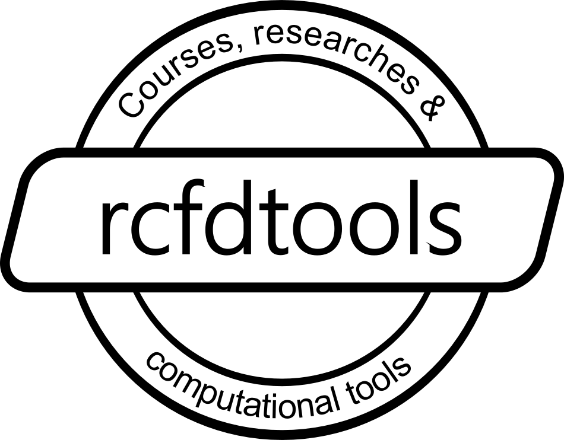

 
Hi, I’m @rcfdtools, Check all my projects here in https://github.com/rcfdtools. I’m interested in Geographical Information Systems - GIS, Hydrology, Hydraulics, Civil Engineering and urban developing projects. I'm currently learning and improving computational numeric methods and CFD in my GitHub projects and i'm looking to collaborate on engineering research projects. Reach me sending me a message through our [Discussion Forum](https://github.com/rcfdtools/rcfdtools/discussions/1).

## WebApp Tools

* [Normal and critical depth in prismatic channels](https://rcfdtools.github.io/rcfdtools/tool/ynyc_prism/)

<!---
rcfdtools/rcfdtools is a ✨ special ✨ repository because its `README.md` (this file) appears on your GitHub profile.
You can click the Preview link to take a look at your changes.
--->

