

# Yn & Yc - Normal and critical depth in prismatic channels

An open channel flow is the movement of a liquid, like water, in a conduit that has a free surface exposed to the atmosphere. Unlike a pipe that is completely full, open channel flow is driven by gravity, and the top surface of the liquid is not under pressure. Common examples include rivers, streams, canals, and storm drains. [:pineapple:**RUN** Tool.](https://rcfdtools.github.io/rcfdtools/tool/ynyc_prism/) 

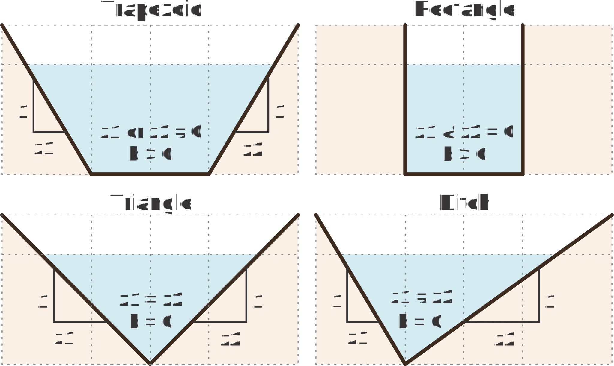

## 1. General concepts

### Manning Equation

The Manning equation is an empirical formula used in fluid dynamics to calculate the flow rate (Q) and velocity (v) of water in an open channel. It is based on the channel's cross-sectional area (A), hydraulic radius (R), slope (S), and Manning's roughness coefficient (n). The equation can be written for flow rate as:

where <i>c</i> = 1 for the international system units or <i>c</i> = 1.49 for the imperial system.

### Froude Number

The Froude number is a dimensionless quantity that compares the inertial force of a fluid to the gravitational force acting on it. It is calculated as the ratio of the flow velocity to the velocity of a gravity wave and is used to describe different flow regimes in open channels, such as rivers and canals. The number is categorized based on its value: supercritical (Fr > 1, fast and deep flow), critical (Fr = 1, where flow velocity equals wave velocity), and subcritical (Fr < 1, slow and shallow flow).

where <i>v</i> is the flow velocity, <i>g</i> is the acceleration due to gravity, and <i>D</i> is the hydraulic depth.

The critical depth serves as a boundary for classifying flow types based on which forces dominate: 

| Flow Regime   | Froude Number _Fr_ | Dominant Forces                              | Flow Characteristics                                                                                               |
|---------------|:------------------:|:---------------------------------------------|:-------------------------------------------------------------------------------------------------------------------|
| Subcritical   |       _Fr<1_       | Gravitational forces                         | Slow, deep, and stable flow, influenced by downstream conditions (e.g., backwater effects).                        |
| Critical      |       _Fr=1_       | Inertial and gravitational forces are equal  | Unstable transition point with minimum specific energy.                                                            |
| Supercritical |       _Fr>1_       | Inertial forces                              | Rapid, shallow, and often unstable flow, influenced by upstream conditions (disturbances cannot travel upstream).  |

## 2. Variables

| Variable | Description                                                                                                                                                                                                                                                                                                                                                                                                                                                                                                                                                                                                                                                                                                                                                                                                                                                                                                                                                                                                            |    SI    |   US    |
|:--------:|:-----------------------------------------------------------------------------------------------------------------------------------------------------------------------------------------------------------------------------------------------------------------------------------------------------------------------------------------------------------------------------------------------------------------------------------------------------------------------------------------------------------------------------------------------------------------------------------------------------------------------------------------------------------------------------------------------------------------------------------------------------------------------------------------------------------------------------------------------------------------------------------------------------------------------------------------------------------------------------------------------------------------------|:--------:|:-------:|
|    Yn    | Normal depth  Is the constant depth of water in an open channel where the flow is steady and uniform, meaning the water surface slope, channel bottom slope, and energy grade line slope are all equal. This occurs when the forces of gravity and friction are balanced, and the flow velocity is not accelerating or decelerating. It is a crucial concept for engineers designing drainage systems and other hydraulic structures, and it is typically calculated using Manning's equation.                                                                                                                                                                                                                                                                                                                                                                                                                                                                                                                   |    m     |   ft    |
|    Yc    | Critical depth  Is the flow depth in an open channel where specific energy is at a minimum for a given discharge. It is the transition point between subcritical flow (where the depth is greater than critical depth) and supercritical flow (where the depth is less than critical depth). Understanding critical depth is vital for designing channels and predicting how water will flow through hydraulic structures. Critical depth is the specific flow depth in an open channel where inertial forces and gravitational forces are in equilibrium. This condition represents the transition point between two different flow regimes (subcritical and supercritical) and corresponds to the minimum specific energy for a given flow rate. The relationship between inertial and gravitational forces in open channel flow is quantified by the Froude number _Fr_, a dimensionless parameter. 

   |    m     |   ft    |
|    A     | Geometric area  In a channel is the cross-sectional area of the flow, which represents the space occupied by the fluid as it moves through the channel. It is a crucial parameter for understanding how much water can pass through a channel at any given time.                                                                                                                                                                                                                                                                                                                                                                                                                                                                                                                                                                                                                                                                                                                                                 |    m²    |   ft²   |
|    P     | Wet perimeterIs the length of the channel boundary that is in contact with the fluid flowing through it. This includes the bottom and sides of the channel or pipe, but not the free surface of the water. It is a key factor in fluid mechanics for calculating a channel hydraulic radius and understanding friction losses in open channel and pipe flow.                                                                                                                                                                                                                                                                                                                                                                                                                                                                                                                                                                                                                                                           |    m     |   ft    |
|    T     | Top widthIs the horizontal width at the waters surface. It is a critical measurement used in hydraulics to calculate other channel properties like the flow area and hydraulic depth. For a simple rectangular channel, the top width is the same as the bottom width, but for a trapezoidal channel, it is calculated by adding twice the horizontal run of the side slopes to the bottom width.                                                                                                                                                                                                                                                                                                                                                                                                                                                                                                                                                                                                                      |    m     |   ft    |
|    R     | Hydraulic ratio  Is the ratio of the cross-sectional area of the flow to the wetted perimeter. It is calculated as R=A/P, where A is the flow area and P is the wetted perimeter. This value indicates the efficiency of a channel in transporting water, with a higher hydraulic radius leading to increased flow velocity and capacity.

                                                                                                                                                                                                                                                                                                                                                                                                                                                                                                                                                                        |    m     |   ft    |
|    D     | Hydraulic depthIs the ratio of the cross-sectional area of flow A to the top width T of the water surface, expressed as D=A/T. It is a key parameter in open channel hydraulics, particularly useful for calculating things like the Froude number and energy relationships, while hydraulic radius is used for frictional losses. In a rectangular channel, the hydraulic depth is simply equal to the vertical depth of the flow.,

                                                                                                                                                                                                                                                                                                                                                                                                                                                                                   |    m     |    m    |
|    V     | Velocity  Is the speed of the fluid, which varies across the cross-section, being zero at the boundaries and increasing towards the free surface. It is calculated using formulas like the Manning's equation, which considers the channels hydraulic radius, slope, and roughness. The mean velocity is often used for design and can be estimated by averaging velocities at specific depths, such as 0.2 and 0.8 of the total depth, or by taking the velocity at 0.6 of the depth from the surface. 

                                                                                                                                                                                                                                                                                                                                                                                                                |   m/s    |  ft/s   |
|    τօ    | Shear stress (tau)In channels is the force exerted by a fluid flowing over a surface, acting parallel to that surface and causing a drag or friction force. It is calculated as the force per unit area and is a measure of the fluids resistance to flow, which can erode the channel bed or be a factor in sediment transport. The stress is also present between layers of the fluid itself and is influenced by factors like fluid viscosity, flow depth, channel slope, and turbulence. 

                                                                                                                                                                                                                                                                                                                                                                                                                            | Pa, N/m² | lbf/ft² |
|    F     | Hydraulic force  In open channels, hydraulic force is the force exerted by the flowing water, which is driven primarily by gravity and influenced by pressure and shear stress. This force is essential for understanding and designing channels, as it can be used to measure discharge, control water levels, and dissipate energy through structures like hydraulic jumps.

                                                                                                                                                                                                                                                                                                                                                                                                                                                                                                                                    |    N     |   lbf   |
|    Sc    | Critical slope  In open channels is the specific bed slope at which the normal depth of flow Yn is equal to the critical depth Yc. At this slope, the flow is uniform and critical, with a Froude number of 1. It serves as a boundary to classify a channels slope as "mild" So<Sc, where normal depth is greater than critical depth Yn>Yc, or "steep" So>Sc, where normal depth is less than critical depth Yn<Yc.

                                                                                                                                                                                                                                                                                                                                                                                                                                                                                            |          |         |
|          |                                                                                                                                                                                                                                                                                                                                                                                                                                                                                                                                                                                                                                                                                                                                                                                                                                                                                                                                                                                                                        |          |         |

## 2. Sample exercises

Samples exercises with different prismatic geometries. 

> Channels with negative side slopes may require deep knowledge about the numerical method used and the approach of the correct geometric solution. 

| Exercise  and Parameters                                                                                                                                                                                                                                            | Cross-section                                                              |
|---------------------------------------------------------------------------------------------------------------------------------------------------------------------------------------------------------------------------------------------------------------------|----------------------------------------------------------------------------|
| **YnYcE0001** - Trapezoidal ditch channel with negative side slopes and subcritical regime.  Parameters: unit_sys = 'SI', q = 10, g = 9.806, b = 20, z1 = -4, z2 = -4, so = 0.0008969, n = 0.035, alpha = 1, rho = 1000, y1 = 0.0001, y2 = 2, steps = 64.     |  |
| **YnYcE0002** - Trapezoidal ditch channel with negative side slopes and supercritical regime.  Parameters: unit_sys = 'SI', q = 10, g = 9.806, b = 20, z1 = -4, z2 = -4, so = 0.1, n = 0.035, alpha = 1, rho = 1000, y1 = 0.0001, y2 = 2, steps = 64.         |  |
| **YnYcE0003** - Trapezoidal channel in subcritical regime.  Parameters: unit_sys = 'SI', q = 10, g = 9.806, b = 5, z1 = 2, z2 = 2, so = 0.0008969, n = 0.035, alpha = 1, rho = 1000, y1 = 0.0001, y2 = 5, steps = 64.                                         |  |
| **YnYcE0004** - Trapezoidal channel in supercritical regime.  Parameters: unit_sys = 'SI', q = 10, g = 9.806, b = 5, z1 = 2, z2 = 2, so = 0.1, n = 0.035, alpha = 1, rho = 1000, y1 = 0.0001, y2 = 5, steps = 64.                                             |  |
| **YnYcE0005** - Rectangular channel in subcritical regime.  Parameters: unit_sys = 'SI', q = 10, g = 9.806, b = 5, z1 = 0, z2 = 0, so = 0.0008969, n = 0.035, alpha = 1, rho = 1000, y1 = 0.0001, y2 = 10, steps = 64.                                        |  |
| **YnYcE0006** - Rectangular channel in supercritical regime.  Parameters: unit_sys = 'SI', q = 10, g = 9.806, b = 5, z1 = 0, z2 = 0, so = 0.1, n = 0.035, alpha = 1, rho = 1000, y1 = 0.0001, y2 = 10, steps = 64.                                            |  |
| **YnYcE0007** - Triangular channel in subcritical regime.  Parameters: unit_sys = 'SI', q = 10, g = 9.806, b = 0, z1 = 3, z2 = 3, so = 0.0008969, n = 0.035, alpha = 1, rho = 1000, y1 = 0.0001, y2 = 10, steps = 64.                                         |  |
| **YnYcE0008** - Triangular channel in supercritical regime.  Parameters: unit_sys = 'SI', q = 10, g = 9.806, b = 0, z1 = 3, z2 = 3, so = 0.1, n = 0.035, alpha = 1, rho = 1000, y1 = 0.0001, y2 = 10, steps = 64.                                             |  |
| **YnYcE0009** - Triangular ditch channel in subcritical regime.  Parameters: unit_sys = 'SI', q = 10, g = 9.806, b = 0, z1 = 1, z2 = 30, so = 0.0008969, n = 0.035, alpha = 1, rho = 1000, y1 = 0.0001, y2 = 10, steps = 64.                                  |  |
| **YnYcE0010** - Triangular ditch channel in supercritical regime.  Parameters: unit_sys = 'SI', q = 10, g = 9.806, b = 0, z1 = 1, z2 = 30, so = 0.1, n = 0.035, alpha = 1, rho = 1000, y1 = 0.0001, y2 = 10, steps = 64.                                      |  |
| **YnYcE0011** - Trapezoidal ditch channel in subcritical regime.  Parameters: unit_sys = 'SI', q = 10, g = 9.806, b = 5, z1 = 0, z2 = 30, so = 0.0008969, n = 0.035, alpha = 1, rho = 1000, y1 = 0.0001, y2 = 10, steps = 64.                                 | 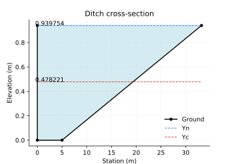 |
| **YnYcE0012** - Trapezoidal ditch channel in supercritical regime.  Parameters: unit_sys = 'SI', q = 10, g = 9.806, b = 5, z1 = 0, z2 = 30, so = 0.1, n = 0.035, alpha = 1, rho = 1000, y1 = 0.0001, y2 = 10, steps = 64.                                     | 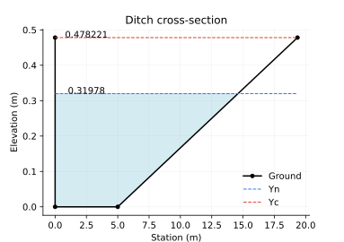 |
| **YnYcE0013** - Trapezoidal ditch channel with negative left side slope in subcritical regime.  Parameters: unit_sys = 'SI', q = 10, g = 9.806, b = 5, z1 = -5, z2 = 30, so = 0.0008969, n = 0.035, alpha = 1, rho = 1000, y1 = 0.0001, y2 = 10, steps = 64.  | 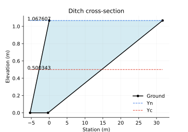 |
| **YnYcE0014** - Trapezoidal ditch channel with negative left side slope in subcritical regime.  Parameters: unit_sys = 'SI', q = 10, g = 9.806, b = 5, z1 = -5, z2 = 30, so = 0.0008969, n = 0.035, alpha = 1, rho = 1000, y1 = 0.0001, y2 = 10, steps = 64. | 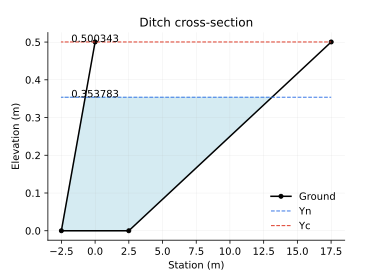 |

## 3. HEC-RAS modeling

The exercise _YnYcE0003_ used as a sample in this section , correspond to a trapezoidal channel in subcritical regime with the parameters: unit_sys = 'SI', q = 10, g = 9.806, b = 5, z1 = 2, z2 = 2, so = 0.0008969, n = 0.035, alpha = 1, rho = 1000, y1 = 0.0001, y2 = 5, steps = 64.

### 1D modeling

1. Once you run the Yn & Yc tool, you retrieve the 1D cross-section values required to import and create geometry channel up and downstream. Save the values into a .txt or a .csv file and then from the geometry editor goto _File / Import Geometry Data: CSV (Comma Separate Value) Format_.

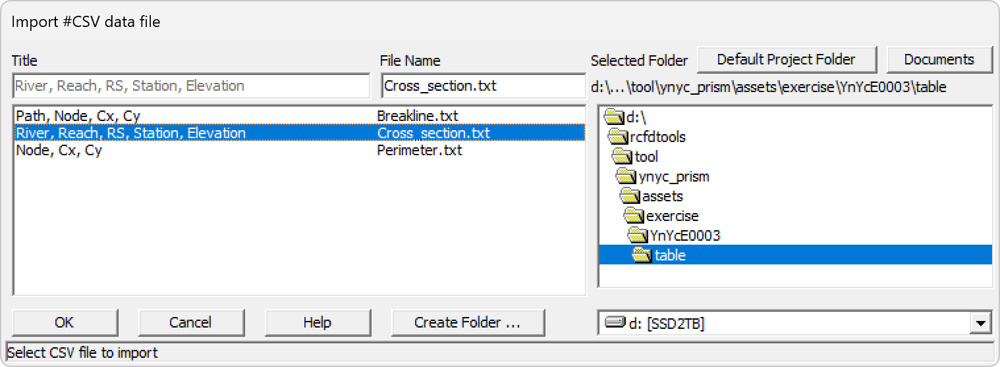

2. The tool also provides the 1D river coordinates, copy and paste those values into _GIS Tools / Reach Invert Lines Table..._

3. To set the correct view extent, goto _View / Set Schematic Plot Extents..._ and _Set to Computed Extents_.

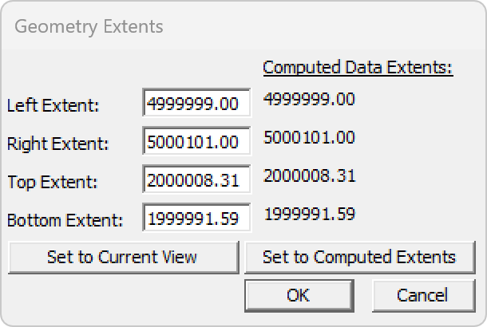

4. After the cross-section creation and the river definition, you must assign manually the reach lengths, Manning's values, and bank positions.

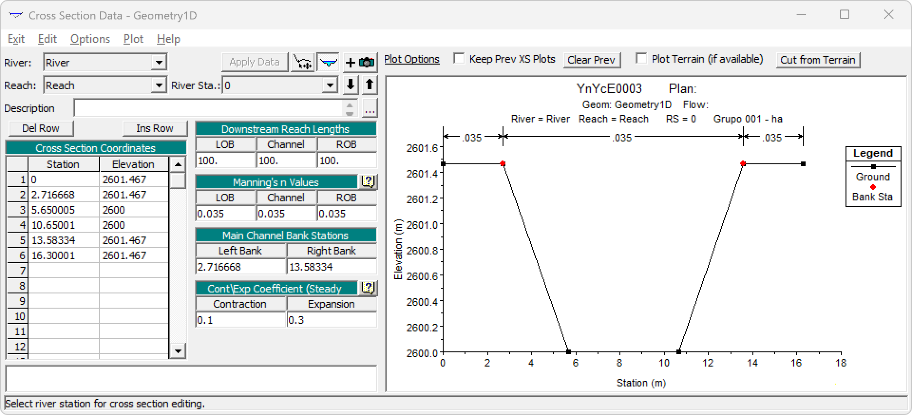

5. The next step is interpolate sections between the up and down cross-sections, from _Tools / XS Interpolation / Between 2 XS's..._

6. Check the river profile.

7. From the main HEC-RAS window, set the Steady Flow Data and the Boundary Conditions.

8. From the main HEC-RAS window, create a Steady Flow Analysis plan and _Compute_.

9. Check the steady profile results.

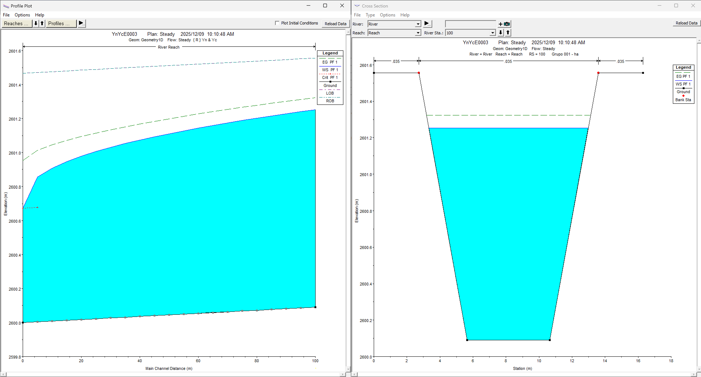

10. To perform the unsteady flow simulation, use the time distributed flow with a triangular unitary hydrograph (UH) generated by the tool or your own hydrograph. For the unsteady flow data, set upstream the Flow Hydrograph with an EG Slope for distribution flow along BC Line = 0.0008969 m/m and downstream the Normal Depth assigning the calculates critical slope Sc = 0.015417396313628427 m/m.

11. From the main HEC-RAS window, create an Unsteady Flow Analysis plan, set the _Advanced Time Step Control_ with _Adjust Time Step Based on Courant_ and _Compute_.

12. Check the unsteady profile results.

13. Now, the results mapping can be performed directly by RAS Mapper, first you need to set up a Coordinates Reference System - CRS from _Project / Set Projection..._. In this example, we are going to use the file [MAGNA_OrigenNacional.prj](assets/projectionfile/) from South América - Colombia. 

14. From Geometries / Geometry1D / Export Layer / Create Terrain GeoTiff from XS's (Overbanks and Channel), generate a 0.1 meters resolution terrain as _/dem/dem.tif_. Once the terrain is generated, from the Terrains / Create a New RAS Terrain, set the new DTM. Adjust the surface fill style to grayscale.

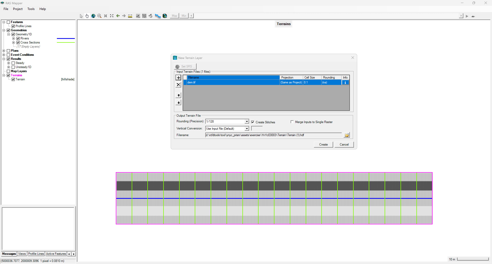

15. Execute the Steady and Unsteady plans checking the _Flood Mapping_ option and check the results in RAS Mapper.

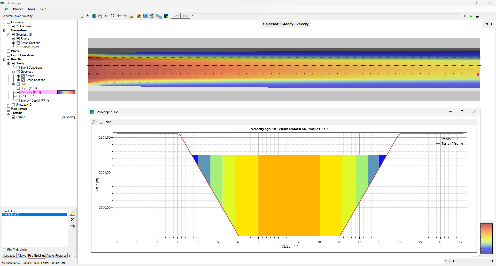

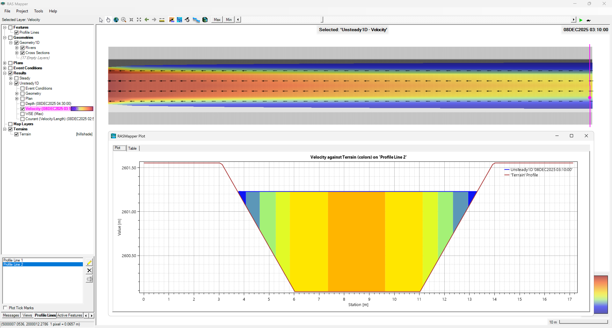

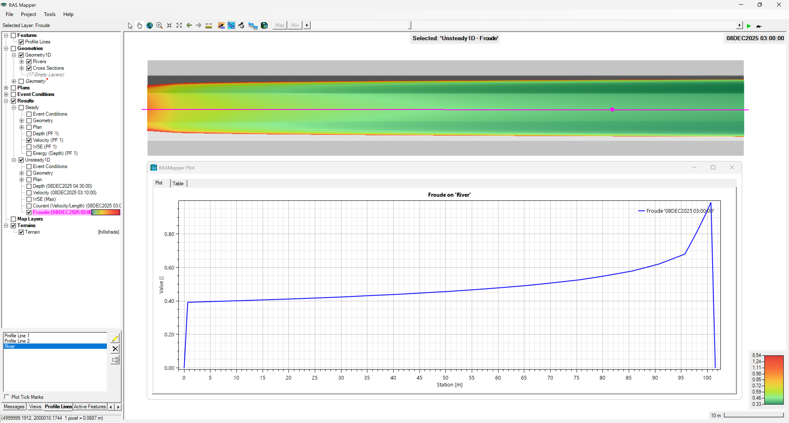

### 2D modeling

1. Save the 2D perimeter coordinates generated by the YnYc tool as a .txt or .csv file in _/table/Perimeter.txt_. In QGIS, run the tool _Layer / Add Layer / Add Delimited Text Layer..._

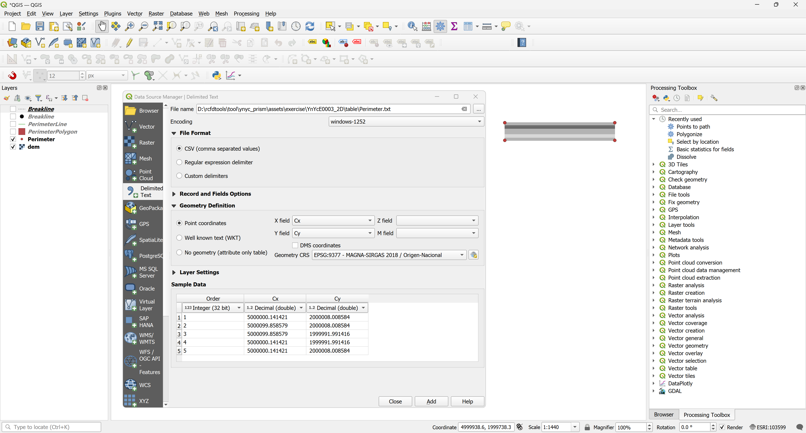

2. With the QGIS tool _Points to Path_, create the external line that describe the perimeter 2D region and save the shapefile as _/shp/PerimeterLine.shp_. 

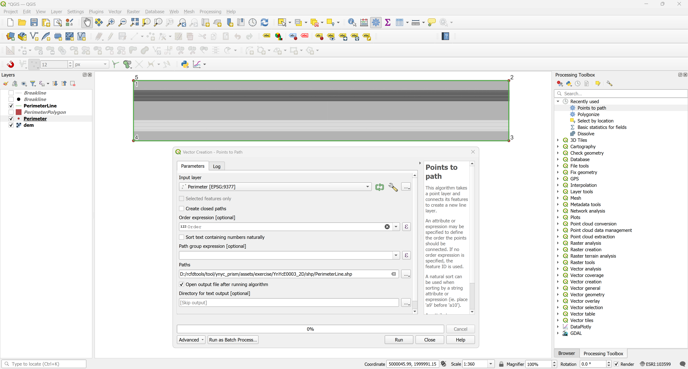

3. With the QGIS tool _Poligonize_, create the polygon of the perimeter 2D region and save the shapefile as _/shp/PerimeterPolygon.shp_. 

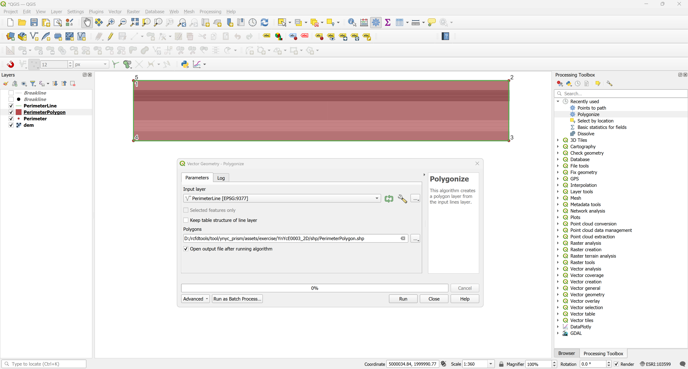

4. Save the 2D breaklines coordinates generated by the YnYc tool as a .txt or .csv file in _/table/Breakline.txt_. In QGIS, run the tool _Layer / Add Layer / Add Delimited Text Layer..._

5. With the QGIS tool _Points to Path_, create the external line that describe the perimeter 2D region and save the shapefile as _/shp/Breakline.shp_. 

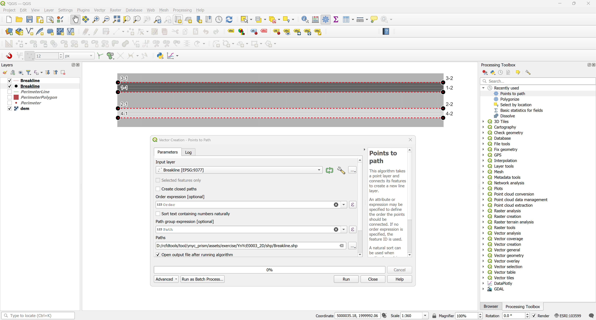

6. In HEC-RAS, create a new project and set the Coordinates Reference System - CRS from _Project / Set Projection..._. In this example, we are going to use the file [MAGNA_OrigenNacional.prj](assets/projectionfile/) from South América - Colombia. From the Terrains / Create a New RAS Terrain, set the new DTM. Adjust the surface fill style to grayscale. 

7. From Geometries, creates a New Geometry as _Geometry2D_ and create a perimeter importing the PerimeterPolygon.shp, then the Breaklines and draw manually the Boundary Condition Lines. Set the cell size in 0.5 x 0.5 meters and the break lines enforcement also un 0.5 meters.

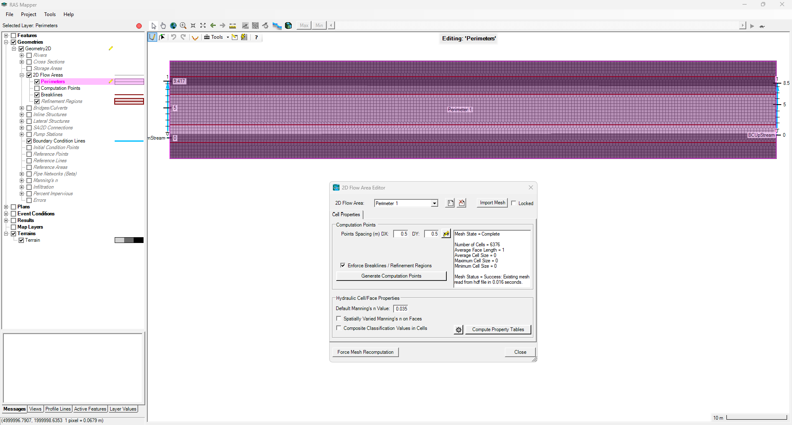

8. In the Unsteady Flow Data, set the boundary condition. BCUpstream has to contain the Flow Hydrograph with the EG Slope for distributing flow along BC Line as So = 0.0008969 m/m and BCDownStream with the Sc = 

9. In the Unsteady Flow Analysis, set the Computation Interval in 5 seconds and Adjust the Time Step Based on Courant from 0.1 to 3.1. Mapping, Hydrograph Output Interval and Detailed Ouput Interval, must be set in 1 Minute.

10. In the Unsteady Computation Options and Tolerances, select the Equation Set with Diffusion Wave or SWW-ELM depending on if you want to include the local and convective acceleration.

11. Compute the model and check the results Log.

12. Check the depth results and the profile over the Thalweg.

13. Check the velocity profile.

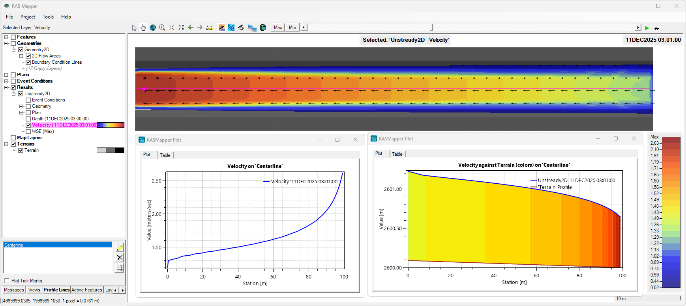

14. Check the Courant and Froude Number map.

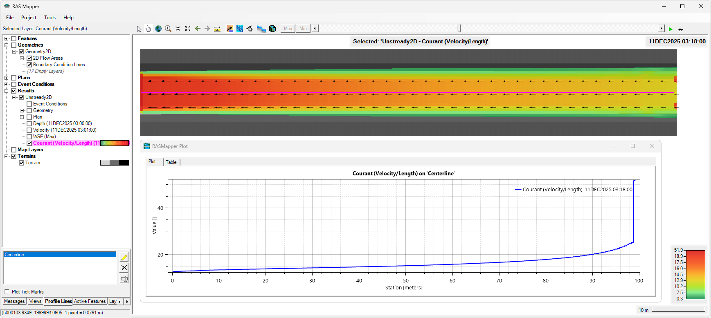

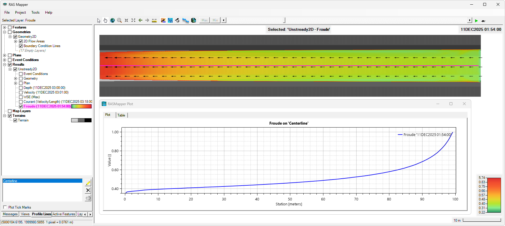

## Libraries used

* [Matplotlib](https://matplotlib.org/)
* [Pyscript](https://pyscript.net/)

## References

* https://www.hec.usace.army.mil/confluence/rasdocs/rasum/6.3/entering-and-editing-geometric-data/importing-geometric-data
* https://uomustansiriyah.edu.iq/media/lectures/5/5_2019_04_22!08_20_51_PM.pdf
* https://www.hec.usace.army.mil/confluence/hmsdocs/hmstrm/transform/unit-hydrograph-basic-concepts
* [bennyistanto / Unit Hydrographs](https://gist.github.com/bennyistanto/62a5427c2780c50d2b3dd69649e0a58f)
* https://www.hec.usace.army.mil/confluence/rasdocs/rasum/6.1/performing-a-1d-unsteady-flow-analysis/entering-and-editing-unsteady-flow-data/boundary-conditions
* https://www.fsl.orst.edu/geowater/FX3/help/8_Hydraulic_Reference/Mannings_n_Tables.htm

## Developers

* https://github.com/rcfdtools
* https://github.com/frankv13
* https://github.com/juanrodace
