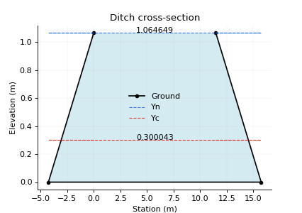

# Yn & Yc - Normal and critical depth in prismatic channels

An open channel flow is the movement of a liquid, like water, in a conduit that has a free surface exposed to the atmosphere. Unlike a pipe that is completely full, open channel flow is driven by gravity, and the top surface of the liquid is not under pressure. Common examples include rivers, streams, canals, and storm drains. 

## General concepts

### Manning Equation

The Manning equation is an empirical formula used in fluid dynamics to calculate the flow rate (Q) and velocity (v) of water in an open channel. It is based on the channel's cross-sectional area (A), hydraulic radius (R), slope (S), and Manning's roughness coefficient (n). The equation can be written for flow rate as:

where <i>c</i> = 1 for the international system units or <i>c</i> = 1.49 for the imperial system.

### Froude Number

The Froude number is a dimensionless quantity that compares the inertial force of a fluid to the gravitational force acting on it. It is calculated as the ratio of the flow velocity to the velocity of a gravity wave and is used to describe different flow regimes in open channels, such as rivers and canals. The number is categorized based on its value: supercritical (Fr > 1, fast and deep flow), critical (Fr = 1, where flow velocity equals wave velocity), and subcritical (Fr < 1, slow and shallow flow).

where <i>v</i> is the flow velocity, <i>g</i> is the acceleration due to gravity, and <i>D</i> is the hydraulic depth.

### Hydraulic depth (D)

Is the ratio of the cross-sectional area of flow A to the top width T of the water surface, expressed as D=A/T. It is a key parameter in open channel hydraulics, particularly useful for calculating things like the Froude number and energy relationships, while hydraulic radius is used for frictional losses. In a rectangular channel, the hydraulic depth is simply equal to the vertical depth of the flow.',

### Wet perimeter (P)

Is the length of the channel boundary that is in contact with the fluid flowing through it. This includes the bottom and sides of the channel or pipe, but not the free surface of the water. It is a key factor in fluid mechanics for calculating a channel hydraulic radius and understanding friction losses in open channel and pipe flow.

### Top width (T)

Is the horizontal width at the waters surface. It is a critical measurement used in hydraulics to calculate other channel properties like the flow area and hydraulic depth. For a simple rectangular channel, the top width is the same as the bottom width, but for a trapezoidal channel, it is calculated by adding twice the horizontal run of the side slopes to the bottom width.

### Hydraulic ratio (R)

Is the ratio of the cross-sectional area of the flow to the wetted perimeter. It is calculated as R=A/P, where A is the flow area and P is the wetted perimeter. This value indicates the efficiency of a channel in transporting water, with a higher hydraulic radius leading to increased flow velocity and capacity.

### Normal depth (Yn)

Is the constant depth of water in an open channel where the flow is steady and uniform, meaning the water surface slope, channel bottom slope, and energy grade line slope are all equal. This occurs when the forces of gravity and friction are balanced, and the flow velocity is not accelerating or decelerating. It is a crucial concept for engineers designing drainage systems and other hydraulic structures, and it is typically calculated using Manning's equation.

### Critical depth (Yc)

Is the flow depth in an open channel where specific energy is at a minimum for a given discharge. It is the transition point between subcritical flow (where the depth is greater than critical depth) and supercritical flow (where the depth is less than critical depth). Understanding critical depth is vital for designing channels and predicting how water will flow through hydraulic structures.

### Velocity (v)

Is the speed of the fluid, which varies across the cross-section, being zero at the boundaries and increasing towards the free surface. It is calculated using formulas like the Manning's equation, which considers the channels hydraulic radius, slope, and roughness. The mean velocity is often used for design and can be estimated by averaging velocities at specific depths, such as 0.2 and 0.8 of the total depth, or by taking the velocity at 0.6 of the depth from the surface.

### Geometric area (A)

In a channel is the cross-sectional area of the flow, which represents the space occupied by the fluid as it moves through the channel. It is a crucial parameter for understanding how much water can pass through a channel at any given time.

### Shear stress (τօ), tau

In channels is the force exerted by a fluid flowing over a surface, acting parallel to that surface and causing a drag or friction force. It is calculated as the force per unit area and is a measure of the fluids resistance to flow, which can erode the channel bed or be a factor in sediment transport. The stress is also present between layers of the fluid itself and is influenced by factors like fluid viscosity, flow depth, channel slope, and turbulence.

### Hydraulic force (F)

In open channels, hydraulic force is the force exerted by the flowing water, which is driven primarily by gravity and influenced by pressure and shear stress. This force is essential for understanding and designing channels, as it can be used to measure discharge, control water levels, and dissipate energy through structures like hydraulic jumps.

### Critical slope (Sc)

In open channels is the specific bed slope at which the normal depth of flow Yn is equal to the critical depth Yc. At this slope, the flow is uniform and critical, with a Froude number of 1. It serves as a boundary to classify a channels slope as "mild" So<Sc, where normal depth is greater than critical depth Yn>Yc, or "steep" So>Sc, where normal depth is less than critical depth Yn<Yc.

## Sample exercises

### YnYcE0001 - Ditch channel with negative side slopes and subcritical regime.

* unit_sys = 'SI'
* q = 10
* g = 9.806
* b = 20
* z1 = -4
* z2 = -4
* so = 0.0008969
* n = 0.035
* alpha = 1
* rho = 1000
* y1 = 0.0001
* y2 = 2
* steps = 128

## Libraries used

* [Matplotlib](https://matplotlib.org/)
* [Pyscript](https://pyscript.net/)

## Developers

* github.com/rcfdtools
* github.com/frankv13
* github.com/juanrodace
